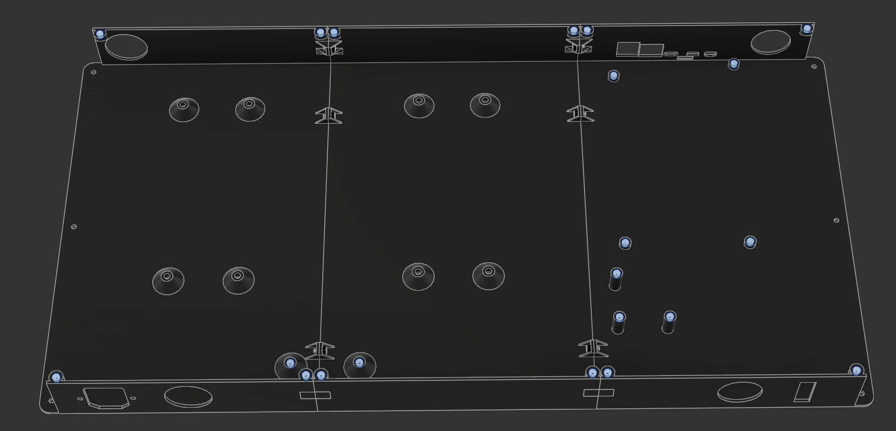
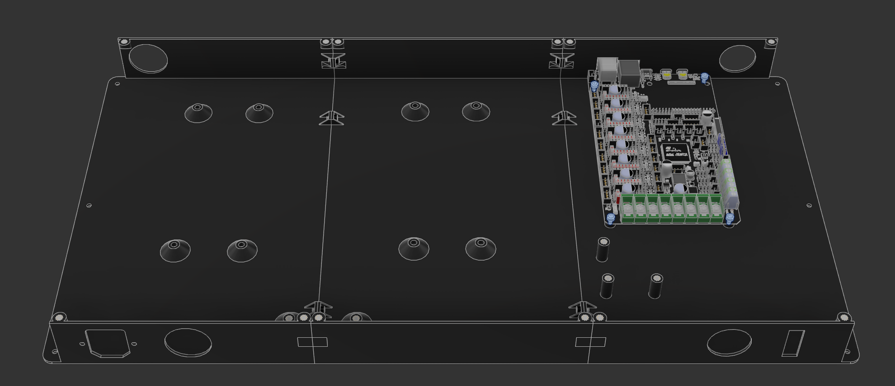
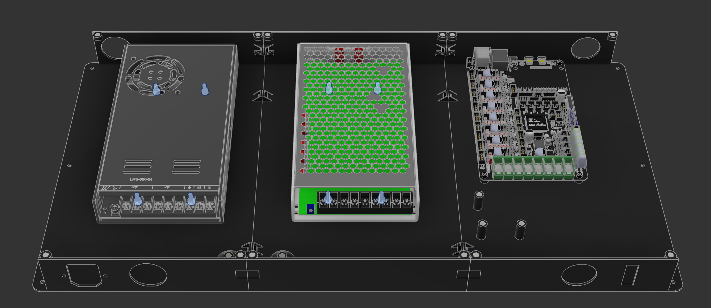
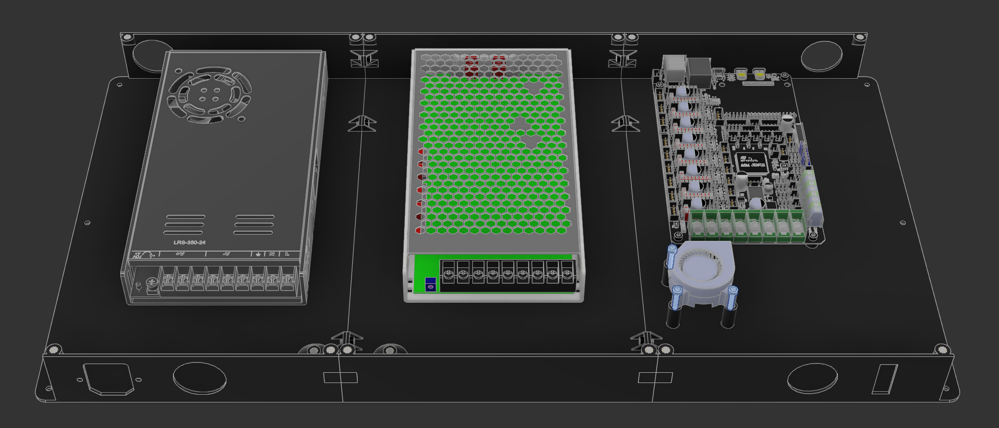
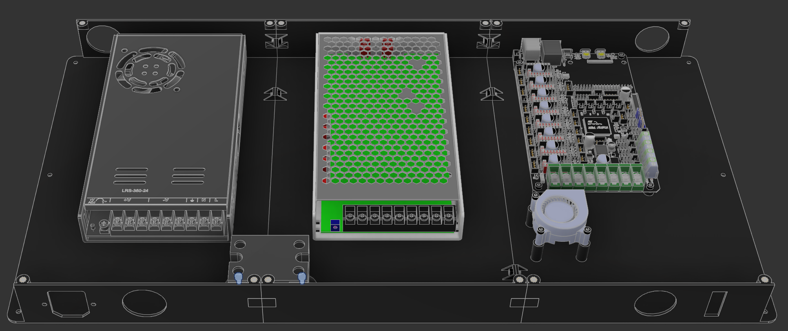
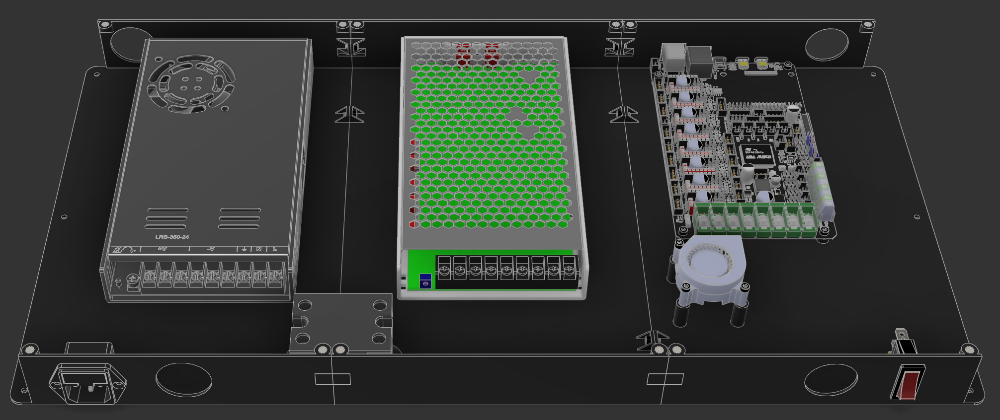
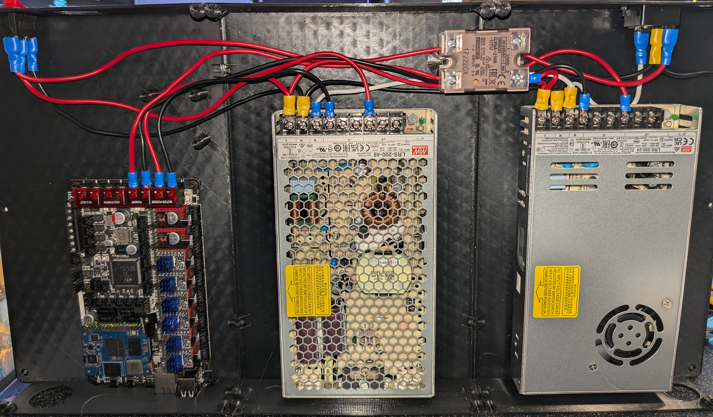

# Hardware Assembly

!!! danger "Minimal Documentation"

    The build guide for assembling the Ender 5 Mint Edition is fairly minimal, and assumes you have a basic knowledge of how a 3D printer works. It will walk through basic wiring for the main power (mains, 24v, and 48v) but will not help you much past that.

    If you need more in-depth direction to how electronics are mounted in the enclosure, please refer to the Fusion CAD on [Gettting Started](index.md)

    If you do not know how to connect a custom mainboard to a printer, or are intimidated by this message, **do not continue past this warning**

## Electronics Enclosure

### Printed Parts

The electronics enclosure is printed in 6 parts (refer to the [BOM](bom.md)). 

1. The main parts are simply screwed together with M3x6 SHCS from the center piece into the 8 joints between the pieces, no nuts or inserts needed:

    

2. M3x5x4 heat-set inserts are inserted into the main shell for mounting the mesh and a few electronics:

    \

3. Mount the M8P using 4 M3x4 SHCS:

    

4. Mount the power supplies (or singular power supply) using M4x8 SHCS:

    

5. Mount the 4020 blower fan to the 3 raised standoffs using M3x16 SHCS:

    

6. Mount the SSR to the small standoffs between the power supplies using M3x6 SHCS:

    

7. Mount the KCD rocker switch **gold pin towards the bottom** and the IEC C14 fuse plug. The plug uses 2 M3x8 countersunk screws:

    

8. Mount the electronics enclosure in place of the original enclosure, using M3x6 SHCS. No pictures for this step :cry:
9. Using the 4 M4x35 SHCS, mount the feet extensions to the bottom of the printer, re-using the original rubber feet and washer for vibration dampening
10. Using 8 M3x16 SHCS and 8 M3 nuts, mount the 4010 axial fans to the M8P mesh part. There are specific mounting holes for these. **Make sure** the blades will pull air into the enclosure!

### Wiring

Wire everything together! Refer to the picture and to the diagram for more information:

#### Mains

| Source              | Destination         | Color | Multiple Crimp at Destination |
| ------------------- | ------------------- | ----- | ----------------------------- |
| IEC 14 Top          | KCD Rocker Top      | Red   | No                            |
| KCD Rocker Middle   | LRS-200-48 Live (L) | Red   | Yes                           |
| LRS-200-48 Live (L) | LRS-350-24 Live (L) | Red   | Yes                           |
| LRS-350-24 Live (L) | SSR Port 2          | Red   | No                            |

#### Ground

| Source                | Destination           | Color | Multiple Crimp at Destination |
| --------------------- | --------------------- | ----- | ----------------------------- |
| IEC 14 Bottom         | LRS-350-24 Ground (⏚) | White | Yes                           |
| LRS-350-24 Ground (⏚) | LRS-200-48 Ground (⏚) | White | No                            |

#### Neutral

!!! note "Add 2 wires at IEC 14"

    We need two wires coming from the IEC 14 plug. One will go to the bed directly, and the other will follow the diagram below

| Source                 | Destination            | Color | Multiple Crimp at Destination |
| ---------------------- | ---------------------- | ----- | ----------------------------- |
| IEC 14 Middle          | LRS-350-24 Neutral (N) | Black | Yes                           |
| LRS-350-24 Neutral (N) | LRS-200-48 Neutral (N) | Black | Yes                           |
| LRS-200-48 Neutral (N) | KCD Rocker Bottom      | Black | Yes                           |

#### 24V V+ and V-

| Source        | Destination | Color | Type |
| ------------- | ----------- | ----- | ---- |
| LRS-350-24 V+ | M8P Power + | Red   | V+   |
| LRS-350-24 V- | M8P Power - | Black | V-   |

#### 48V V+ and V-

!!! danger "Voltage Difference"

    ***Make sure*** that your 24V and 48V lines do not cross! You ***will*** destroy components if you do so!

    **You have been warned**

| Source        | Destination       | Color | Type |
| ------------- | ----------------- | ----- | ---- |
| LRS-200-48 V+ | M8P Motor Power + | Red   | V+   |
| LRS-200-48 V- | M8P Motor Power - | Black | V-   |