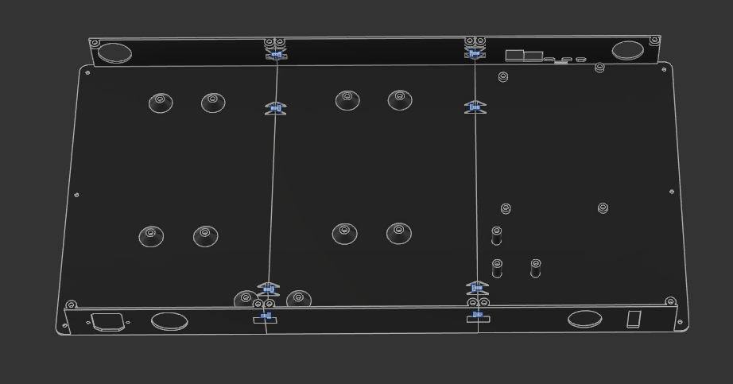

# Assembly

!!! danger "Minimal Documentation"

    The build guide for assembling the Ender 5 Mint Edition is fairly minimal, and assumes you have a basic knowledge of how a 3D printer works. It will walk through basic wiring for the main power (mains, 24v, and 48v) but will not help you much past that.

    If you need more in-depth direction to how electronics are mounted in the enclosure, please refer to the Fusion CAD on [Gettting Started](index.md)

    If you do not know how to connect a custom mainboard to a printer, or are intimidated by this message, **do not continue past this warning**

## Electronics Enclosure

### Printed Parts

The electronics enclosure is printed in 6 parts (refer to the [BOM](bom.md)). 

1. The main parts are simply screwed together with M3x6 SHCS from the center piece into the 8 joints between the pieces, no nuts or inserts needed:

